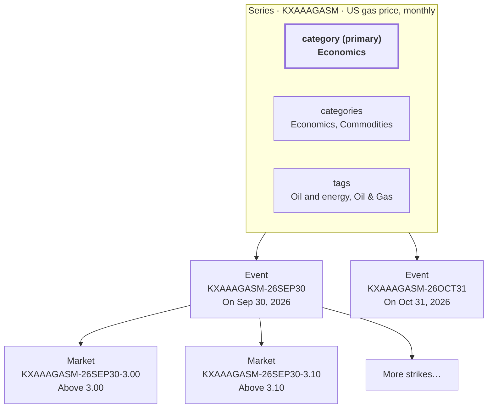

> ## Documentation Index
> Fetch the complete documentation index at: https://docs.kalshi.com/llms.txt
> Use this file to discover all available pages before exploring further.

# Kalshi Glossary

> Core terminology used in the Kalshi exchange

Here are some core terminologies used in Kalshi exchange:

**Category:** A high-level discovery grouping for related series, such as sports, crypto, or weather. Each series has a primary `category` and a list of discovery categories, `categories`. Use [Get Series List](/api-reference/market/get-series-list) with the `category` filter to browse series in a category; the filter matches any of a series' categories.

**Subcategory:** A narrower discovery grouping within a category. A series can belong to multiple subcategories. In API filters, subcategories are often represented as tags; use [Get Tags for Series Categories](/api-reference/search/get-tags-for-series-categories) to discover tags grouped by category.

**Market:** A single binary market. This is a low level object which rarely will need to be exposed on its own to members. The usage of the term "market" here is consistent with how it's used in the backend and API.

**Event:** An event is a collection of markets and the basic unit that members should interact with on Kalshi.

**Series:** A series is a collection of related events. The following should hold true for events that make up a series:

* Each event should look at similar data for determination, but translated over another, disjoint time period.
* Series should never have a logical outcome dependency between events.
* Events in a series should have the same ticker prefix.

## How the Objects Fit Together

The series is the top-level object. Each event belongs to exactly one series (`series_ticker`), and each market belongs to exactly one event (`event_ticker`).

Categories and subcategories are not levels above the series. They are fields on the series, used for discovery:

* `category` is the series' **primary** category. Each series has exactly one.
* `categories` lists every category the series appears under. The `category` filter on [Get Series List](/api-reference/market/get-series-list) matches against this list.
* `tags` lists the series' subcategories. The `tags` filter on Get Series List matches against this list. A series' tags can come from more than one of its categories.

[Get Tags for Series Categories](/api-reference/search/get-tags-for-series-categories) returns the category-to-tag map, built from series that currently have open markets.

For example, the monthly US gas price series has `Economics` as its primary category and also appears under `Commodities`. Its `Oil and energy` tag is an Economics subcategory and its `Oil & Gas` tag is a Commodities subcategory. The series has one event per month, and each event has one market per price strike:

| Object | Example | Parent field | How to list it |
| - | - | - | - |
| Series | `KXAAAGASM` | None (top level) | [Get Series List](/api-reference/market/get-series-list) with `category=Economics` or `category=Commodities` |
| Event | `KXAAAGASM-26SEP30` | `series_ticker` | [Get Events](/api-reference/events/get-events) with `series_ticker=KXAAAGASM` |
| Market | `KXAAAGASM-26SEP30-3.00` | `event_ticker` | [Get Markets](/api-reference/market/get-markets) with `event_ticker=KXAAAGASM-26SEP30` |

## Ticker Conventions

Categories and subcategories help organize and filter series, but they are not part of the ticker convention.

Tickers often follow `Series -> Event -> Market`: for example, the `KXHIGHNY` series may have an event like `KXHIGHNY-24JAN01`, and that event may have a market like `KXHIGHNY-24JAN01-T60`. There are occasional exceptions, so do not parse ticker strings to infer relationships. Best practice is to use the series, event, market, and search endpoints and rely on fields like `series_ticker`, `event_ticker`, `category`, and `tags`.

<Note>
  Please see the "Timeline and Payout" dropdown on a market's page to find the Market, Event, and Series tickers. Note that the market ticker will depend on which market you are looking at on that page. For example, Trump and Harris are each their own market.
</Note>

This documentation is built and hosted on [Mintlify](https://mintlify.com), a developer documentation platform.